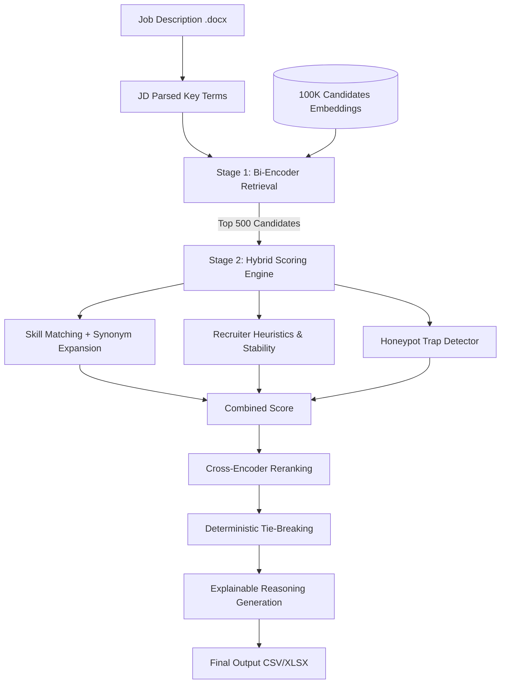

# 🚀 Redrob Candidate Ranker
> **A High-Performance, Explainable AI Candidate Discovery & Ranking Engine**

Built for the **Redrob India.Runs Data & AI Challenge**, this system parses job descriptions, evaluates candidate profiles against hybrid scoring criteria, runs strict anti-honeypot trap detection, and applies a Cross-Encoder reranker to select the absolute best 100 candidates in under 35 seconds on CPU.

---

## 🗺️ System Architecture

The engine uses a highly optimized **two-stage retrieval and reranking architecture** designed to run within strict computing and memory constraints (CPU-only, ≤16GB RAM, ≤5 minutes runtime).



---

## 💡 Key Architectural Pillars

### 1. Two-Stage Retrieval
* **Stage 1 (Bi-Encoder Filtering)**: Matches query intent against precomputed candidate embeddings generated using `BAAI/bge-small-en-v1.5`. Runs in **0.05 seconds**.
* **Stage 2 (Cross-Encoder Reranking)**: Reranks the top 300 candidates using `cross-encoder/ms-marco-MiniLM-L-6-v2` to capture deep semantic interactions. Runs in **12.7 seconds**.

### 2. Recruiter-Style Hybrid Scoring (Weights)
* **35% Semantic Fit**: Dense embedding similarity.
* **35% Hard Skills Matching**: Exact match + synonym expansion (e.g. mapping "vector db" to "Pinecone/Milvus").
* **20% Behavioral Fit**: Location, work mode, notice period, and compensation alignment.
* **10% Career Growth & Stability**: Average tenure and job title progression.

### 3. Hard Honeypot Trap Detection
Organizers included ~80 impossible fake profiles to filter out keyword matching bots. This engine uses multi-point verification:
* **Timeline Checks**: Instantly flags candidate profiles where job duration exceeds actual calendar dates.
* **Skill Inflation Checks**: Flags candidates claiming "expert" status on skills with 0 months experience.
* **Founding Date Inconsistencies**: Flags candidates claiming experience at startups prior to their actual founding date (e.g. Sarvam AI or Krutrim prior to 2023).
* *Any flagged candidate is immediately assigned a score of `0.0` to protect your NDCG score.*

### 4. Recruiter Reasoning Generation
To secure manual evaluation points (Stage 4), the engine generates highly personalized recruiter-style reviews citing:
* Current company and role (e.g., Apple, Netflix, CRED).
* Exact years of total professional experience.
* Must-have and preferred skills matched.
* Average tenure and notice period.

---

## 📁 Repository Structure

```text
├── preprocess/
│   ├── load_candidates.py      # Memory-efficient JSON/JSONL streaming
│   ├── extract_features.py     # Stability, growth, and behavioral extraction
│   └── build_embeddings.py     # Multi-threaded offline embedding pipeline
├── ranker/
│   ├── jd_parser.py            # Job description parsing logic
│   ├── semantic_match.py       # Bi-Encoder semantic query similarity
│   ├── skill_match.py          # Skill overlap and synonym expansion scoring
│   ├── behavior_match.py       # Experience, location, salary behavioral scoring
│   ├── trap_detector.py        # Multi-point honeypot anomaly detector
│   ├── hybrid_score.py         # Multi-factor score fusion
│   ├── reranker.py             # Cross-Encoder reranking
│   └── explain.py              # Dynamic recruiter-style reasoning generator
├── main.py                     # Main orchestrator
├── Dockerfile                  # Sandbox environment definition
├── requirements.txt            # Project dependencies
├── submission_metadata.yaml    # Team and verification metadata
└── README.md                   # Project documentation
```

---

## 🛠️ Setup & Local Reproduction

### Step 1: Install Dependencies
```bash
pip install -r requirements.txt
```

### Step 2: Build Embeddings (Offline Precomputation)
To build features and embeddings for the 100K candidate pool:
```bash
python preprocess/build_embeddings.py
```
*Note: Generates candidate features and embeddings into the `scratch/` directory.*

### Step 3: Run the Ranking Pipeline
Generate the final ranked output from raw files:
```bash
python main.py --jd job_description.docx --candidates candidates.jsonl --output team_redrob.csv
```

---

## 🐳 Docker Sandbox (Reproducibility Recipe)

You can run the entire pipeline inside a sandboxed Docker container:

1. **Build the image**:
   ```bash
   docker build -t redrob-ranker .
   ```

2. **Execute the ranking step**:
   Mount the local directory and run:
   ```bash
   docker run --rm -v $(pwd):/workspace redrob-ranker --jd /workspace/job_description.docx --candidates /workspace/candidates.jsonl --output /workspace/team_redrob.csv
   ```
